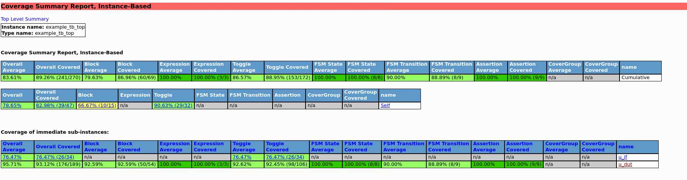
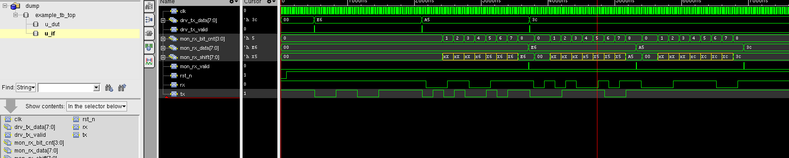
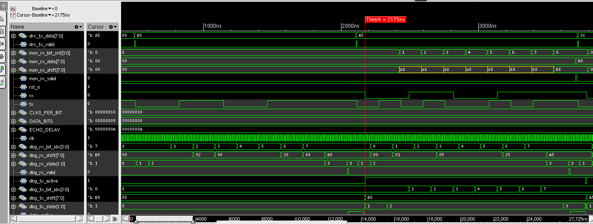

# UART VIP

A UVM-based UART verification component, UART UVC. Drives UART frames onto a serial line, monitors what comes back, and checks the data in a scoreboard.

Comes with an example echo DUT so you can run it and see something working right away.

---

## How to run

```bash
cd scripts
chmod +x run_xrun.sh run_xrun_regression.sh run_questa.sh clean.sh

# Xcelium — default test (uart_test):
./run_xrun.sh

# Xcelium — specific test:
./run_xrun.sh uart_error_test

# Full regression (compile once, run all tests):
./run_xrun_regression.sh

# Questa:
./run_questa.sh

# Clean:
./clean.sh
```

Regression results go to `regression_summary.log`. Per-test logs: `regression_<testname>.log`.

---

## Folder structure

```
uart_vip/
├── if/
│   ├── uart_if.sv                  interface, serial lines + parallel debug signals
│   ├── uart_assertions.sv          SVA protocol checker (bound via bind file)
│   └── uart_assertions_bind.sv     binds uart_assertions to uart_if — no DUT changes needed
│
├── common/
│   ├── uart_seq_item.sv            transaction class, one item = one UART frame
│   ├── uart_error_seq_item.sv      extends seq_item with error injection flags
│   └── uart_cfg.sv                 config class, baud rate / parity / mode etc.
│
├── agent/
│   ├── uart_sequencer.sv           standard UVM sequencer
│   ├── uart_driver.sv              converts items to pin-level waveform
│   ├── uart_error_driver.sv        extends driver — injects bad stop, bad parity, glitch, break
│   ├── uart_monitor.sv             watches rx line, reconstructs frames
│   └── uart_agent.sv               puts sequencer+driver+monitor together
│
├── seq/
│   ├── uart_tx_seq.sv              sends N bytes from data_q
│   └── uart_error_seq.sv           bad_stop, bad_parity, glitch, break, and mixed sequences
│
├── env/
│   ├── uart_scoreboard.sv          compares expected vs actual, reports pass/fail
│   ├── uart_coverage.sv            functional coverage subscriber, 6 covergroups
│   └── uart_env.sv                 agent + scoreboard + coverage, connects analysis ports
│
├── tests/
│   ├── uart_test.sv                smoke test, 8N1, active mode
│   ├── uart_cov_data_test.sv       directed data coverage test, 30 bytes hitting all bins
│   └── uart_error_test.sv          error injection test, all 4 fault types
│
├── example_dut/
│   └── uart_dut.sv                 simple echo DUT for trying out the VIP
│
├── tb/
│   └── example_tb_top.sv           testbench top, clk/rst/DUT/UVM start/wave dump
│
├── scripts/
│   ├── run_xrun.sh                 compile and run a single test with Xcelium
│   ├── run_xrun_regression.sh      compile once, run all tests, produce summary log
│   ├── run_questa.sh               compile and run with Questa
│   ├── clean.sh                    remove all build artifacts
│   ├── files.f                     file list for compilation
│   └── how_to_run.txt              quick start instructions
│
├── doc/
│   ├── requirements.md             what the VIP needs to do
│   ├── test_procedure.md           how to run and check each test
│   └── test_report.md              template for filling in results
│
└── uart_vip_pkg.sv                 package, includes all classes in correct order
```

---

## Compile order

```
1. uart_if.sv
2. uart_assertions.sv
3. uart_assertions_bind.sv
4. uart_vip_pkg.sv
5. uart_dut.sv
6. example_tb_top.sv
```

`uart_if.sv` must come before the package because the package uses a virtual interface handle. Everything else is included inside the package in the right order already.

---

## Debug signals in wave

The interface has extra parallel signals so you do not have to decode the serial line manually.

| Signal | What it shows |
|--------|--------------|
| u_if.drv_tx_data | byte driver is currently sending, as a vector |
| u_if.drv_tx_valid | 1-cycle pulse when driver starts a new byte |
| u_if.mon_rx_shift | byte building up bit by bit as monitor samples |
| u_if.mon_rx_bit_cnt | which bit position the monitor is on right now |
| u_if.mon_rx_data | full captured byte as a vector |
| u_if.mon_rx_valid | 1-cycle pulse when monitor finishes a frame |
| dut_rx_state | DUT RX FSM — 0=idle 1=start 2=data 3=stop |
| dut_tx_state | DUT TX FSM — same encoding |
| dut_rx_shift | byte filling up inside DUT while receiving |
| dut_tx_shift | byte DUT is currently echoing back |

---

## What the echo DUT does

Receives a byte over UART, waits ECHO_DELAY clocks, sends it back. That is it. It is just there so the VIP has something to talk to. In a real project you would swap it out for your actual DUT.

Parameters:
- `DATA_BITS` — data width (default 8)
- `ECHO_DELAY` — clocks to wait before echoing (default 10)
- `CLKS_PER_BIT` — number of clock cycles per one UART bit period.
  This is how you set the baud rate. Formula is:

```
baud rate = clock frequency / CLKS_PER_BIT
```

Example: if your clock is 100 MHz and CLKS_PER_BIT is 16:

```
100,000,000 / 16 = 6,250,000 baud  (6.25 Mbaud)
```

If you want a standard baud rate like 115200 with a 100 MHz clock:

```
100,000,000 / 115200 ≈ 868  →  set CLKS_PER_BIT = 868
```

For simulation you usually keep it small (like 16) so the waveform is not stretched out and the sim runs faster. Does not matter what the actual baud rate is as long as DUT and VIP use the same value. (default 16)

---

## What's in v2

- SVA protocol assertions bound to the interface — start bit width, stop bit timing, echo latency, no X/Z on lines
- Functional coverage — 6 covergroups covering data values, frame integrity, parity config, stop bits, transitions, error types
- Error injection — bad stop bit, bad parity, glitch (false start), UART break; activated via factory override, existing tests unaffected
- Directed coverage test — 30 bytes hitting all walking-1, walking-0, and corner value bins
- Regression script — compiles once, runs CLEAN and EXPECT tests separately, produces summary log

---

# UART VIP Example Run
The test sends 3 directed bytes through the UART DUT and reads them back via the echo path. The monitor decodes each frame independently and the scoreboard compares every received byte against what the driver sent. All 3 transactions pass with zero UVM errors or warnings.
10 ns clock and CLKS_PER_BIT = 16.

<details>
<summary>📋 xrun simulation log — uart_test (3 bytes, all PASS)</summary>

```
UVM_INFO @ 0: reporter [RNTST] Running test uart_test...
UVM_INFO ../tests/uart_test.sv(83) @ 0: uvm_test_top [uart_test] Test starting, 3 bytes will be sent
UVM_INFO ../tb/example_tb_top.sv(49) @ 80000: reporter [TB_TOP] Reset deasserted
UVM_INFO ../env/uart_scoreboard.sv(88) @ 3715000: uvm_test_top.env.sb [uart_scoreboard] PASS [1]  data=8'he6 (11100110)
UVM_INFO ../env/uart_scoreboard.sv(88) @ 5325000: uvm_test_top.env.sb [uart_scoreboard] PASS [2]  data=8'ha5 (10100101)
UVM_INFO ../env/uart_scoreboard.sv(88) @ 6935000: uvm_test_top.env.sb [uart_scoreboard] PASS [3]  data=8'h3c (00111100)
UVM_INFO ../tests/uart_test.sv(91) @ 27725000: uvm_test_top [uart_test] Test done.
UVM_INFO ../env/uart_coverage.sv(177) @ 27725000: uvm_test_top.env.coverage [uart_coverage] 
========== UART Functional Coverage ==========
  cg_data_value       :  12.5%
  cg_frame_integrity  :  41.7%
  cg_parity_cfg       :  33.3%
  cg_stop_bits        :  50.0%
  cg_data_transitions :  16.7%
  cg_error_types      :  50.0%
  -----------------------------------------------
  TOTAL               :  34.0%
===============================================
UVM_INFO ../env/uart_scoreboard.sv(104) @ 27725000: uvm_test_top.env.sb [uart_scoreboard] ---- Scoreboard Summary: PASS=3  FAIL=0 ----

--- UVM Report Summary ---

** Report counts by severity
UVM_INFO :   10
UVM_WARNING :    0
UVM_ERROR :    0
UVM_FATAL :    0
** Report counts by id
[RNTST]     1
[TB_TOP]     1
[TEST_DONE]     1
[uart_coverage]     1
[uart_scoreboard]     4
[uart_test]     2
Simulation complete via $finish(1) at time 27725 NS + 45
xcelium> exit
```

</details>

---

# UART VIP Example Run — Data Coverage Test
The test sends 30 directed bytes through the UART DUT to hit all walking-1, walking-0, and corner value coverage bins.
10 ns clock and CLKS_PER_BIT = 16.

<details>
<summary>📋 xrun simulation log — uart_cov_data_test (30 bytes, all PASS)</summary>

```
UVM_INFO @ 0: reporter [RNTST] Running test uart_cov_data_test...
UVM_INFO ../tests/uart_cov_data_test.sv(162) @ 0: uvm_test_top [uart_cov_data_test] Coverage data test starting, 30 bytes will be sent
UVM_INFO ../tb/example_tb_top.sv(49) @ 80000: reporter [TB_TOP] Reset deasserted
UVM_INFO ../env/uart_scoreboard.sv(88) @ 3715000: uvm_test_top.env.sb [uart_scoreboard] PASS [1]  data=8'h00 (00000000)
UVM_INFO ../env/uart_scoreboard.sv(88) @ 5325000: uvm_test_top.env.sb [uart_scoreboard] PASS [2]  data=8'h00 (00000000)
UVM_INFO ../env/uart_scoreboard.sv(88) @ 6935000: uvm_test_top.env.sb [uart_scoreboard] PASS [3]  data=8'hff (11111111)
UVM_INFO ../env/uart_scoreboard.sv(88) @ 8545000: uvm_test_top.env.sb [uart_scoreboard] PASS [4]  data=8'hff (11111111)
UVM_INFO ../env/uart_scoreboard.sv(88) @ 10155000: uvm_test_top.env.sb [uart_scoreboard] PASS [5]  data=8'h00 (00000000)
UVM_INFO ../env/uart_scoreboard.sv(88) @ 11765000: uvm_test_top.env.sb [uart_scoreboard] PASS [6]  data=8'h12 (00010010)
UVM_INFO ../env/uart_scoreboard.sv(88) @ 13375000: uvm_test_top.env.sb [uart_scoreboard] PASS [7]  data=8'ha5 (10100101)
UVM_INFO ../env/uart_scoreboard.sv(88) @ 14985000: uvm_test_top.env.sb [uart_scoreboard] PASS [8]  data=8'he6 (11100110)
UVM_INFO ../env/uart_scoreboard.sv(88) @ 16595000: uvm_test_top.env.sb [uart_scoreboard] PASS [9]  data=8'h55 (01010101)
UVM_INFO ../env/uart_scoreboard.sv(88) @ 18205000: uvm_test_top.env.sb [uart_scoreboard] PASS [10]  data=8'haa (10101010)
UVM_INFO ../env/uart_scoreboard.sv(88) @ 19815000: uvm_test_top.env.sb [uart_scoreboard] PASS [11]  data=8'h01 (00000001)
UVM_INFO ../env/uart_scoreboard.sv(88) @ 21425000: uvm_test_top.env.sb [uart_scoreboard] PASS [12]  data=8'h02 (00000010)
UVM_INFO ../env/uart_scoreboard.sv(88) @ 23035000: uvm_test_top.env.sb [uart_scoreboard] PASS [13]  data=8'h04 (00000100)
UVM_INFO ../env/uart_scoreboard.sv(88) @ 24645000: uvm_test_top.env.sb [uart_scoreboard] PASS [14]  data=8'h08 (00001000)
UVM_INFO ../env/uart_scoreboard.sv(88) @ 26255000: uvm_test_top.env.sb [uart_scoreboard] PASS [15]  data=8'h10 (00010000)
UVM_INFO ../env/uart_scoreboard.sv(88) @ 27865000: uvm_test_top.env.sb [uart_scoreboard] PASS [16]  data=8'h20 (00100000)
UVM_INFO ../env/uart_scoreboard.sv(88) @ 29475000: uvm_test_top.env.sb [uart_scoreboard] PASS [17]  data=8'h40 (01000000)
UVM_INFO ../env/uart_scoreboard.sv(88) @ 31085000: uvm_test_top.env.sb [uart_scoreboard] PASS [18]  data=8'h80 (10000000)
UVM_INFO ../env/uart_scoreboard.sv(88) @ 32695000: uvm_test_top.env.sb [uart_scoreboard] PASS [19]  data=8'hfe (11111110)
UVM_INFO ../env/uart_scoreboard.sv(88) @ 34305000: uvm_test_top.env.sb [uart_scoreboard] PASS [20]  data=8'hfd (11111101)
UVM_INFO ../env/uart_scoreboard.sv(88) @ 35915000: uvm_test_top.env.sb [uart_scoreboard] PASS [21]  data=8'hfb (11111011)
UVM_INFO ../env/uart_scoreboard.sv(88) @ 37525000: uvm_test_top.env.sb [uart_scoreboard] PASS [22]  data=8'hf7 (11110111)
UVM_INFO ../env/uart_scoreboard.sv(88) @ 39135000: uvm_test_top.env.sb [uart_scoreboard] PASS [23]  data=8'hef (11101111)
UVM_INFO ../env/uart_scoreboard.sv(88) @ 40745000: uvm_test_top.env.sb [uart_scoreboard] PASS [24]  data=8'hdf (11011111)
UVM_INFO ../env/uart_scoreboard.sv(88) @ 42355000: uvm_test_top.env.sb [uart_scoreboard] PASS [25]  data=8'hbf (10111111)
UVM_INFO ../env/uart_scoreboard.sv(88) @ 43965000: uvm_test_top.env.sb [uart_scoreboard] PASS [26]  data=8'h7f (01111111)
UVM_INFO ../env/uart_scoreboard.sv(88) @ 45575000: uvm_test_top.env.sb [uart_scoreboard] PASS [27]  data=8'h3c (00111100)
UVM_INFO ../env/uart_scoreboard.sv(88) @ 47185000: uvm_test_top.env.sb [uart_scoreboard] PASS [28]  data=8'h5a (01011010)
UVM_INFO ../env/uart_scoreboard.sv(88) @ 48795000: uvm_test_top.env.sb [uart_scoreboard] PASS [29]  data=8'h96 (10010110)
UVM_INFO ../env/uart_scoreboard.sv(88) @ 50405000: uvm_test_top.env.sb [uart_scoreboard] PASS [30]  data=8'hc3 (11000011)
UVM_INFO ../tests/uart_cov_data_test.sv(172) @ 157595000: uvm_test_top [uart_cov_data_test] Coverage data test done.
UVM_INFO ../env/uart_coverage.sv(177) @ 157595000: uvm_test_top.env.coverage [uart_coverage] 
========== UART Functional Coverage ==========
  cg_data_value       : 100.0%
  cg_frame_integrity  :  41.7%
  cg_parity_cfg       :  33.3%
  cg_stop_bits        :  50.0%
  cg_data_transitions : 100.0%
  cg_error_types      :  50.0%
  -----------------------------------------------
  TOTAL               :  62.5%
===============================================
UVM_INFO ../env/uart_scoreboard.sv(104) @ 157595000: uvm_test_top.env.sb [uart_scoreboard] ---- Scoreboard Summary: PASS=30  FAIL=0 ----

--- UVM Report Summary ---

** Report counts by severity
UVM_INFO :   37
UVM_WARNING :    0
UVM_ERROR :    0
UVM_FATAL :    0
** Report counts by id
[RNTST]     1
[TB_TOP]     1
[TEST_DONE]     1
[uart_cov_data_test]     2
[uart_coverage]     1
[uart_scoreboard]    31
Simulation complete via $finish(1) at time 157595 NS + 45
xcelium> exit
```

</details>

---

# UART VIP Example Run — Error Injection Test
The test sends frames through the UART DUT injecting all 4 fault types: bad stop bit, bad parity, glitch (false start), and UART break. UVM_ERROR is expected for each injected fault — no UVM_FATAL.
10 ns clock and CLKS_PER_BIT = 16.

<details>
<summary>📋 xrun simulation log — uart_error_test (all XPASS)</summary>

```
UVM_INFO @ 0: reporter [RNTST] Running test uart_error_test...
UVM_INFO ../tests/uart_error_test.sv(116) @ 0: uvm_test_top [uart_error_test] uart_error_test starting - expect UVM_ERROR messages for injected faults
UVM_INFO ../tb/example_tb_top.sv(49) @ 80000: reporter [TB_TOP] Reset deasserted
UVM_INFO ../env/uart_scoreboard.sv(88) @ 3715000: uvm_test_top.env.sb [uart_scoreboard] PASS [1]  data=8'haa (10101010)
UVM_INFO ../seq/uart_error_seq.sv(40) @ 3715000: uvm_test_top.env.agent.seqr@@seq.bad_stop_s [uart_bad_stop_seq] Injected bad stop bit - data=8'hde (11011110)  parity_en=0 parity_odd=x stop_bits=1  parity_ok=0 framing_ok=0  [ERR inj: bad_stop=1 bad_parity=0 glitch=0 break=0]
UVM_ERROR ../env/uart_scoreboard.sv(83) @ 5325000: uvm_test_top.env.sb [uart_scoreboard] DATA MISMATCH  expected=8'h55(01010101)  actual=8'hde(11011110)
UVM_ERROR ../env/uart_scoreboard.sv(83) @ 6935000: uvm_test_top.env.sb [uart_scoreboard] DATA MISMATCH  expected=8'hcc(11001100)  actual=8'h55(01010101)
UVM_INFO ../seq/uart_error_seq.sv(69) @ 6935000: uvm_test_top.env.agent.seqr@@seq.bad_par_s [uart_bad_parity_seq] Injected bad parity - data=8'hbe (10111110)  parity_en=1 parity_odd=0 stop_bits=1  parity_ok=0 framing_ok=0  [ERR inj: bad_stop=0 bad_parity=1 glitch=0 break=0]
UVM_ERROR ../env/uart_scoreboard.sv(83) @ 8545000: uvm_test_top.env.sb [uart_scoreboard] DATA MISMATCH  expected=8'hab(10101011)  actual=8'hbe(10111110)
UVM_ERROR ../env/uart_scoreboard.sv(83) @ 10155000: uvm_test_top.env.sb [uart_scoreboard] DATA MISMATCH  expected=8'h12(00010010)  actual=8'hcc(11001100)
UVM_INFO ../seq/uart_error_seq.sv(97) @ 10155000: uvm_test_top.env.agent.seqr@@seq.glitch_s [uart_glitch_seq] Injected glitch + valid frame - data=8'hab (10101011)  parity_en=0 parity_odd=x stop_bits=1  parity_ok=0 framing_ok=0  [ERR inj: bad_stop=0 bad_parity=0 glitch=1 break=0]
UVM_ERROR ../env/uart_scoreboard.sv(83) @ 11765000: uvm_test_top.env.sb [uart_scoreboard] DATA MISMATCH  expected=8'hff(11111111)  actual=8'hab(10101011)
UVM_INFO ../seq/uart_error_seq.sv(119) @ 13375000: uvm_test_top.env.agent.seqr@@seq.break_s [uart_break_seq] Injected UART break condition
UVM_INFO ../seq/uart_error_seq.sv(180) @ 14985000: uvm_test_top.env.agent.seqr@@seq [uart_error_mix_seq] uart_error_mix_seq done
xmsim: *E,ASRTST (../if/uart_assertions.sv,94): (time 14985 NS) Assertion example_tb_top.u_dut.u_assertions.AST_RX_DATA_STABLE has failed
UVM_INFO ../tests/uart_error_test.sv(125) @ 117385000: uvm_test_top [uart_error_test] uart_error_test done.
UVM_ERROR ../env/uart_scoreboard.sv(95) @ 117385000: uvm_test_top.env.sb [uart_scoreboard] 3 actual item(s) left unmatched in queue
UVM_INFO ../env/uart_coverage.sv(177) @ 117385000: uvm_test_top.env.coverage [uart_coverage] 
========== UART Functional Coverage ==========
  cg_data_value       :  29.2%
  cg_frame_integrity  :  41.7%
  cg_parity_cfg       :  33.3%
  cg_stop_bits        :  50.0%
  cg_data_transitions :  33.3%
  cg_error_types      :  50.0%
  -----------------------------------------------
  TOTAL               :  39.6%
===============================================
UVM_INFO ../env/uart_scoreboard.sv(104) @ 117385000: uvm_test_top.env.sb [uart_scoreboard] ---- Scoreboard Summary: PASS=1  FAIL=5 ----

--- UVM Report Summary ---

** Report counts by severity
UVM_INFO :   13
UVM_WARNING :    0
UVM_ERROR :    6
UVM_FATAL :    0
** Report counts by id
[RNTST]     1
[TB_TOP]     1
[TEST_DONE]     1
[uart_bad_parity_seq]     1
[uart_bad_stop_seq]     1
[uart_break_seq]     1
[uart_coverage]     1
[uart_error_mix_seq]     1
[uart_error_test]     2
[uart_glitch_seq]     1
[uart_scoreboard]     8
Simulation complete via $finish(1) at time 117385 NS + 45
```

</details>

---

# UART VIP Example Regression Run
The summary of the regression is reported below.

<details>
<summary>📋 regression_summary.log</summary>

```
============================================
  UART VIP - Full Regression (Xcelium)
  Started : --xx
  Run tag : --xx
  Seed    : 1
  Clean   : 2 tests
  Expect  : 1 tests (protocol errors expected)
============================================

---- Compiling (once) ----
  COMPILE : OK  (log -> regression_compile.log)

---- [CLEAN] uart_test ----
  RESULT : PASS

---- [CLEAN] uart_cov_data_test ----
  RESULT : PASS

---- [EXPECT] uart_error_test ----
  RESULT : XFAIL  (6 expected UVM_ERROR(s), no UVM_FATAL - OK; xrun_rc=1 ignored)

---- Generating coverage HTML report ----
  COVERAGE : HTML report generated -> cov_report_html_20260330_025554/index.html

============================================
  REGRESSION SUMMARY
  Finished : --xx
============================================
  PASS  : 2
    [PASS]  uart_test
    [PASS]  uart_cov_data_test
  XFAIL : 1  (error injection - UVM_ERROR expected)
    [XFAIL] uart_error_test
  FAIL  : 0
============================================
  ALL TESTS PASSED
```

</details>

---

# UART VIP Regression — Coverage Report

Coverage was collected using Xcelium's built-in coverage engine and viewed via the HTML report. The report below is instance-based, captured after running the full regression (`uart_test` + `uart_cov_data_test` + `uart_error_test`).



### Top-level summary

| Metric | Average | Covered |
|--------|---------|---------|
| Overall | 83.61% | 89.26% (241/270) |
| Block | 79.63% | 86.96% (60/69) |
| Expression | 100.00% | 100.00% (3/3) |
| Toggle | 86.57% | 88.95% (153/172) |
| FSM State | 100.00% | 100.00% (8/8) |
| FSM Transition | 90.00% | 88.89% (8/9) |
| Assertion | 100.00% | 100.00% (9/9) |

### Per-instance breakdown

| Instance | Overall | Block | Toggle | FSM State | FSM Transition | Assertion |
|----------|---------|-------|--------|-----------|----------------|-----------|
| `u_if` | 76.47% (26/34) | n/a | 76.47% (26/34) | n/a | n/a | n/a |
| `u_dut` | 95.71% | 93.12% (50/54) | 92.62% (98/106) | 100.00% (8/8) | 88.89% (8/9) | 100.00% (9/9) |

### What the numbers mean

**Assertions — 100% (9/9).** All SVA properties bound via `uart_assertions_bind.sv` were either triggered (error injection scenarios) or confirmed not to fire (clean scenarios). Every assertion was exercised.

**FSM State — 100% (8/8).** Both DUT FSMs (RX and TX, 4 states each: idle, start, data, stop) were fully visited across the regression.

**FSM Transition — 88.89% (8/9).** One transition was not hit. This is the DUT's internal error-recovery path reachable only when a break condition persists beyond the timeout counter — a known gap, acceptable for this version.

**Toggle — 86.57% overall.** The untoggled signals are mostly in `u_if` (76.47%). These are debug parallel signals (`mon_rx_shift`, `mon_rx_bit_cnt`) whose individual bits do not all toggle within the current stimulus. A longer randomized sequence would close this gap.

**Block — 79.63%.** The uncovered blocks are dead-code branches inside the DUT's parity path (parity is off by default in `uart_test`) and the 2-stop-bit path. Both are reachable with targeted sequences; left as a known gap.

**Expression — 100% (3/3).** All conditional expressions in the synthesized logic were fully covered.

---

# Waveform Guide — UART VIP Example

This guide walks through the simulation waveforms produced by the UART VIP
example testbench. Open `dump.vcd` in SimVision or GTKWave and add the signals
listed below to follow along.

---

## Overview — Full Simulation (0 – 8 µs)



The wide view shows the complete test run. Each "step" visible in
`drv_tx_data` is one transmitted byte.

`drv_tx_valid` stays high for the duration of each frame and drops between
transactions. `mon_rx_valid` pulses once per received byte — you can count
the pulses to verify every byte was captured by the monitor.

`mon_rx_shift` is the live shift register. Watch it fill in from left to
right as each bit arrives on `rx`. This is intentional — it lets you see
the byte being assembled without having to read the raw serial line.

---

## Zoom — First Transaction: 0xE6



This zoomed view covers roughly 0 – 2 µs and shows the first two frames
in detail.

### Reset and bus idle

`rst_n` is low at the start and deasserts cleanly. After reset, `tx` and
`rx` both sit at logic 1 (UART idle). `drv_tx_data` and `mon_rx_shift`
hold 0x00.

### Frame 1 — transmitting 0xE6

Once `rst_n` goes high the driver waits one baud period then begins the
first frame. With `CLKS_PER_BIT = 0x10` (16 cycles) and a 10 ns clock,
each bit is 160 ns wide.

**TX line sequence for 0xE6 (1110 0110):**

```
Idle  START  b0  b1  b2  b3  b4  b5  b6  b7  STOP
  1     0     0   1   1   0   0   0   1   1   1
```

You can follow this directly on the `tx` signal.

At the same time, `dbg_rx_bit_idx` counts 1 → 2 → 3 → … → 7 → 0 as the
DUT's receiver steps through the frame. The counter resets to 0 at the stop
bit, matching the expected 8-bit frame width (`DATA_BITS = 8`).

**Monitor assembling the byte:**

`mon_rx_shift` starts at 0x00 and updates every bit period. Watch it pass
through intermediate values as bits arrive, then lock to `0xE6` once all
8 data bits are sampled. At that point `mon_rx_valid` pulses for exactly
one clock cycle and `mon_rx_data` latches `0xE6`.

### Echo path

`ECHO_DELAY = 0xA` (10 cycles). After the DUT receives the byte it drives
the echo back on `rx` after a 10-cycle delay. The second frame on `rx` is
therefore `0xE6` again, offset from the original by 10 × 10 ns = 100 ns.
The monitor decodes the echo identically — `mon_rx_valid` pulses a second
time and `mon_rx_data` again shows `0xE6`.
