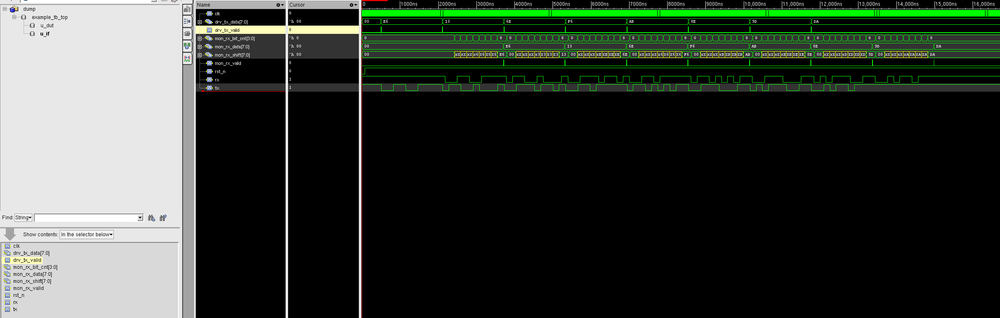
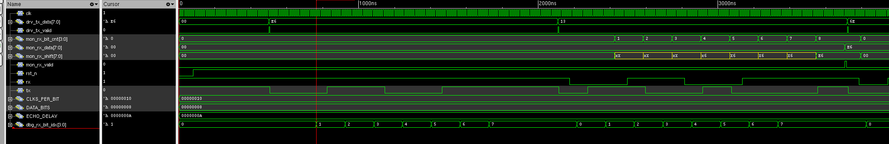

# UART VIP

A UVM-based UART verification component, UART UVC. Drives UART frames onto a serial line, monitors what comes back, and checks the data in a scoreboard. First version is 8N1 only.

Comes with an example echo DUT so you can run it and see something working right away.

---

## How to run

```bash
cd scripts
chmod +x run_questa.sh run_xrun.sh clean.sh

# Questa:
./run_questa.sh

# Xcelium:
./run_xrun.sh

# Clean:
./clean.sh
```

Open EPWave or your simulator's wave viewer after running. Make sure "Open EPWave after run" is checked if you are on EDA Playground.

---

## Folder structure

```
uart_vip/
├── if/
│   └── uart_if.sv              interface, serial lines + parallel debug signals
│
├── common/
│   ├── uart_seq_item.sv        transaction class, one item = one UART frame
│   └── uart_cfg.sv             config class, baud rate / parity / mode etc.
│
├── agent/
│   ├── uart_sequencer.sv       standard UVM sequencer
│   ├── uart_driver.sv          converts items to pin-level waveform
│   ├── uart_monitor.sv         watches rx line, reconstructs frames
│   └── uart_agent.sv           puts sequencer+driver+monitor together
│
├── seq/
│   └── uart_tx_seq.sv          sends N random bytes, also feeds scoreboard mailbox
│
├── env/
│   ├── uart_scoreboard.sv      compares expected vs actual, reports pass/fail
│   └── uart_env.sv             agent + scoreboard, connects analysis ports
│
├── tests/
│   └── uart_test.sv            smoke test, 8N1, active mode
│
├── example_dut/
│   └── uart_dut.sv             simple echo DUT for trying out the VIP
│
├── tb/
│   └── example_tb_top.sv       testbench top, clk/rst/DUT/UVM start/wave dump
│
├── scripts/
│   ├── run_questa.sh           compile and run with Questa
│   ├── run_xrun.sh             compile and run with Xcelium
│   ├── clean.sh                remove all build artifacts
│   ├── files.f                 file list for compilation
│   └── how_to_run.txt          quick start instructions
│
├── doc/
│   ├── requirements.md         what the VIP needs to do
│   ├── test_procedure.md       how to run and check each test
│   └── test_report.md          template for filling in results
│
└── uart_vip_pkg.sv             package, includes all classes in correct order
```

---

## Compile order

```
1. uart_if.sv
2. uart_vip_pkg.sv
3. uart_dut.sv
4. example_tb_top.sv
```

`uart_if.sv` must come before the package because the package uses a virtual interface handle. Everything else is included inside the package in the right order already.

---

## Debug signals in wave

The interface has extra parallel signals so you do not have to decode the serial line manually.

| Signal | What it shows |
|--------|--------------|
| u_if.drv_tx_data | byte driver is currently sending, as a vector |
| u_if.drv_tx_valid | 1-cycle pulse when driver starts a new byte |
| u_if.mon_rx_shift | byte building up bit by bit as monitor samples |
| u_if.mon_rx_bit_cnt | which bit position the monitor is on right now |
| u_if.mon_rx_data | full captured byte as a vector |
| u_if.mon_rx_valid | 1-cycle pulse when monitor finishes a frame |
| dut_rx_state | DUT RX FSM — 0=idle 1=start 2=data 3=stop |
| dut_tx_state | DUT TX FSM — same encoding |
| dut_rx_shift | byte filling up inside DUT while receiving |
| dut_tx_shift | byte DUT is currently echoing back |

---

## What the echo DUT does

Receives a byte over UART, waits ECHO_DELAY clocks, sends it back. That is it. It is just there so the VIP has something to talk to. In a real project you would swap it out for your actual DUT.

Parameters:
- `DATA_BITS` — data width (default 8)
- `ECHO_DELAY` — clocks to wait before echoing (default 10)
- `CLKS_PER_BIT` — number of clock cycles per one UART bit period.
  This is how you set the baud rate. Formula is:
```
  baud rate = clock frequency / CLKS_PER_BIT
```

  Example: if your clock is 100 MHz and CLKS_PER_BIT is 16:
```
  100,000,000 / 16 = 6,250,000 baud  (6.25 Mbaud)
```

  If you want a standard baud rate like 115200 with a 100 MHz clock:
```
  100,000,000 / 115200 ≈ 868  →  set CLKS_PER_BIT = 868
```

  For simulation you usually keep it small (like 16) so the waveform
  is not stretched out and the sim runs faster. Does not matter what
  the actual baud rate is as long as DUT and VIP use the same value.
  (default 16)

---

## First version limitations

- 8N1 only (no parity, 1 stop bit, 8 data bits)
- no functional coverage
- no protocol assertions
- no error injection
- one agent, not separate TX/RX agents

All of these can be added later without restructuring anything.

---
---
# UART VIP Example Run
The test sends 8 random bytes through the UART DUT and reads them back via the echo path. The monitor decodes each frame independently and the scoreboard compares every received byte against what the driver sent. All 8 transactions pass with zero UVM errors or warnings.
10 ns clock and CLKS_PER_BIT = 16.

<details>
<summary>📋 xrun simulation log — uart_test (8 bytes, all PASS)</summary>

```
>>./run_xrun.sh
Running from: ./scripts
TOOL:	xrun(64)
Compiling UVM packages (uvm_pkg.sv cdns_uvm_pkg.sv)
file: ../if/uart_if.sv
	interface worklib.uart_if:sv
		errors: 0, warnings: 0
file: ../uart_vip_pkg.sv
package uart_vip_pkg;
                   |
xmvlog: *W,TSNSPK (../uart_vip_pkg.sv,1|19): `timescale is not specified for the package.  The default timescale of 1ns/1ns will be assumed for this package.
	package worklib.uart_vip_pkg:sv
		errors: 0, warnings: 1
file: ../example_dut/uart_dut.sv
	module worklib.uart_dut:sv
		errors: 0, warnings: 0
file: ../tb/example_tb_top.sv
	module worklib.example_tb_top:sv
		errors: 0, warnings: 0
xmvlog: *W,SPDUSD: Include directory .. given but not used.
xmvlog: *W,SPDUSD: Include directory ../common given but not used.
xmvlog: *W,SPDUSD: Include directory ../agent given but not used.
xmvlog: *W,SPDUSD: Include directory ../env given but not used.
xmvlog: *W,SPDUSD: Include directory ../seq given but not used.
xmvlog: *W,SPDUSD: Include directory ../tests given but not used.
xmvlog: *W,SPDUSD: Include directory ../if given but not used.
xmvlog: *W,SPDUSD: Include directory ../tb given but not used.
	Total errors/warnings found outside modules and primitives:
		errors: 0, warnings: 8
	Elaborating the design hierarchy:
		Caching library 'worklib' ....... Done
	Top level design units:
		uvm_pkg
		cdns_uvmapi
		cdns_assert2uvm_pkg
		cdns_uvm_pkg
		uart_vip_pkg
		example_tb_top
	Building instance overlay tables: .................... Done
	Generating native compiled code:
		worklib.uart_dut:sv <0x70f08765>
			streams:  29, words: 13319
		worklib.example_tb_top:sv <0x051afa12>
			streams: 659, words: 753352
		worklib.cdns_uvm_pkg:sv <0x40cb8f18>
			streams: 172, words: 276655
		worklib.cdns_uvmapi:svp <0x538b9174>
			streams:  27, words: 30445
		worklib.cdns_assert2uvm_pkg:sv <0x223d1a4c>
			streams:   3, words:  1761
		worklib.uvm_pkg:sv <0x19e0a4d0>
			streams: 4534, words: 7150936
	Building instance specific data structures.
	Loading native compiled code:     .................... Done
	Design hierarchy summary:
		                        Instances  Unique
		Modules:                        2       2
		Interfaces:                     1       1
		Verilog packages:               5       5
		Registers:                 14,246  10,279
		Scalar wires:                  13       -
		Vectored wires:                18       -
		Named events:                   4      12
		Always blocks:                  4       4
		Initial blocks:               291     159
		Parallel blocks:               26      27
		Cont. assignments:              7       8
		Pseudo assignments:            12       -
		Assertions:                     2       2
		SV Class declarations:        201     315
		SV Class specializations:     388     388
		Process Clocks:                 3       1
	Writing initial simulation snapshot: worklib.example_tb_top:sv
Loading snapshot worklib.example_tb_top:sv .................... Done
SVSEED default: 1

Simulation SnapShot is worklib.example_tb_top:sv

xcelium> run

UVM_INFO @ 0: reporter [RNTST] Running test uart_test...
UVM_INFO ../tests/uart_test.sv(83) @ 0: uvm_test_top [uart_test] Test starting, 3 bytes will be sent
UVM_INFO ../tb/example_tb_top.sv(49) @ 80: reporter [TB_TOP] Reset deasserted
UVM_INFO ../env/uart_scoreboard.sv(88) @ 3715: uvm_test_top.env.sb [uart_scoreboard] PASS [1]  data=8'he6 (11100110)
UVM_INFO ../agent/uart_monitor.sv(99) @ 3715: uvm_test_top.env.agent.mon [uart_monitor] Captured item <- data=8'he6 (11100110)  parity_en=0 parity_odd=0 stop_bits=1  parity_ok=1 framing_ok=1
UVM_INFO ../env/uart_scoreboard.sv(88) @ 5325: uvm_test_top.env.sb [uart_scoreboard] PASS [2]  data=8'ha5 (10100101)
UVM_INFO ../agent/uart_monitor.sv(99) @ 5325: uvm_test_top.env.agent.mon [uart_monitor] Captured item <- data=8'ha5 (10100101)  parity_en=0 parity_odd=0 stop_bits=1  parity_ok=1 framing_ok=1
UVM_INFO ../env/uart_scoreboard.sv(88) @ 6935: uvm_test_top.env.sb [uart_scoreboard] PASS [3]  data=8'h3c (00111100)
UVM_INFO ../agent/uart_monitor.sv(99) @ 6935: uvm_test_top.env.agent.mon [uart_monitor] Captured item <- data=8'h3c (00111100)  parity_en=0 parity_odd=0 stop_bits=1  parity_ok=1 framing_ok=1
UVM_INFO ../tests/uart_test.sv(91) @ 27725: uvm_test_top [uart_test] Test done.
UVM_INFO /methodology/UVM/CDNS-1.1d/sv/src/base/uvm_objection.svh(1268) @ 27725: reporter [TEST_DONE] 'run' phase is ready to proceed to the 'extract' phase
UVM_INFO ../env/uart_scoreboard.sv(104) @ 27725: uvm_test_top.env.sb [uart_scoreboard] ---- Scoreboard Summary: PASS=3  FAIL=0 ----

--- UVM Report catcher Summary ---


Number of demoted UVM_FATAL reports  :    0
Number of demoted UVM_ERROR reports  :    0
Number of demoted UVM_WARNING reports:    0
Number of caught UVM_FATAL reports   :    0
Number of caught UVM_ERROR reports   :    0
Number of caught UVM_WARNING reports :    0

--- UVM Report Summary ---

** Report counts by severity
UVM_INFO :   12
UVM_WARNING :    0
UVM_ERROR :    0
UVM_FATAL :    0
** Report counts by id
[RNTST]     1
[TB_TOP]     1
[TEST_DONE]     1
[uart_monitor]     3
[uart_scoreboard]     4
[uart_test]     2
Simulation complete via $finish(1) at time 27725 NS + 45
$finish;
xcelium> exit
Simulation time at exit is: 27725000000 FS

```

</details>


# Waveform Guide — UART VIP Example

This guide walks through the simulation waveforms produced by the UART VIP
example testbench. Open `dump.vcd` in SimVision or GTKWave and add the signals
listed below to follow along.

---

## Overview — Full Simulation (0 – 16 µs)



The wide view shows the complete test run. Each "step" visible in
`drv_tx_data` is one transmitted byte. The sequence sent is:

```
0x85 → 0x13 → 0x6E → 0xF5 → 0xAB → 0x5E → 0x5D → 0xDA
```

`drv_tx_valid` stays high for the duration of each frame and drops between
transactions. `mon_rx_valid` pulses once per received byte — you can count
the pulses to verify every byte was captured by the monitor.

`mon_rx_shift` is the live shift register. Watch it fill in from left to
right as each bit arrives on `rx`. This is intentional — it lets you see
the byte being assembled without having to read the raw serial line.

---

## Zoom — First Transaction: 0xE6



This zoomed view covers roughly 0 – 3 µs and shows the first two frames
in detail.

### Reset and bus idle

`rst_n` is low at the start and deasserts cleanly. After reset, `tx` and
`rx` both sit at logic 1 (UART idle). `drv_tx_data` and `mon_rx_shift`
hold 0x00.

### Frame 1 — transmitting 0xE6

Once `rst_n` goes high the driver waits one baud period then begins the
first frame. With `CLKS_PER_BIT = 0x10` (16 cycles) and a 10 ns clock,
each bit is 160 ns wide.

**TX line sequence for 0xE6 (1110 0110):**

```
Idle  START  b0  b1  b2  b3  b4  b5  b6  b7  STOP
  1     0     0   1   1   0   0   0   1   1   1
```

You can follow this directly on the `tx` signal.

At the same time, `dbg_rx_bit_idx` counts 1 → 2 → 3 → … → 7 → 0 as the
DUT's receiver steps through the frame. The counter resets to 0 at the stop
bit, matching the expected 8-bit frame width (`DATA_BITS = 8`).

**Monitor assembling the byte:**

`mon_rx_shift` starts at 0x00 and updates every bit period. Watch it pass
through intermediate values as bits arrive, then lock to `0xE6` once all
8 data bits are sampled. At that point `mon_rx_valid` pulses for exactly
one clock cycle and `mon_rx_data` latches `0xE6`.

### Echo path

`ECHO_DELAY = 0xA` (10 cycles). After the DUT receives the byte it drives
the echo back on `rx` after a 10-cycle delay. The second frame on `rx` is
therefore `0xE6` again, offset from the original by 10 × 10 ns = 100 ns.
The monitor decodes the echo identically — `mon_rx_valid` pulses a second
time and `mon_rx_data` again shows `0xE6`.
